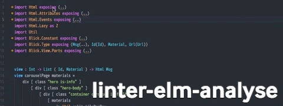

# linter-elm-analyse

Lint your Elm code with [elm-analyse] in Atom Editor. Still very early in development.

[elm-analyse]: https://github.com/stil4m/elm-analyse

Depends on:

- [elm-analyse]
- [linter]

[linter]: https://github.com/steelbrain/linter

Currently no configuration. [elm-analyse] must be installed in your `PATH`.

Working directory will be the most closest parent directory with `elm-package.json` in it.
`elm-analyse.json` must be found there too.

## How it looks

## Alternative

If you prefer running [elm-analyse] on-demand, check out [atom-build] and [build-elm-analyse].

[atom-build] uses [linter] to show errors and warnings so you get the similar results.

Since [elm-analyse] usually takes longer time compared to per-file linters/formatters,
you might get better experience this way.

[atom-build]: https://github.com/noseglid/atom-build
[build-elm-analyse]: https://github.com/ymtszw/build-elm-analyse
